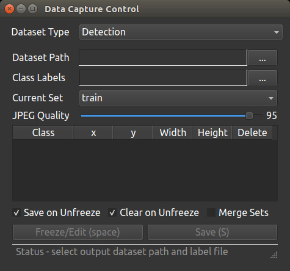

# Setting Up The Car For Object Detection

If the car hasn’t been set up yet, refer to [this notebook](https://github.com/JetRacer-Soccer-League/JetRacer-Soccer-League-Year-1/blob/main/Object%20Detection/Object%20Detection.ipynb) from the Year 1 repository and follow the instructions in the “Setting Up The Camera” and “Setting Up Jetson Inference” sections.


# Collecting Training Images

At this point Jetson Inference should be set up and you should be able to access the live camera feed.

1. Open the terminal and navigate to the ssd folder:

    ```
    cd jetson-inference/python/training/detection/ssd
    ```

2. Run the camera capture feature: 

    ```
    camera-capture csi://0
    ```

    If the camera feed is upside down, run this instead: 

    ```
    camera-capture csi://0 --input-flip=rotate-180
    ```

3. You should now see a live camera feed and the popup box shown below:

    

    Configure the settings as follows:

    <table>
      <tr>
      <td>
    <b>Dataset Type</b>
      </td>
      <td>Detection
      </td>
      </tr>
      <tr>
      <td>
      <b>Dataset Path</b>
      </td>
      <td>jetson → jetson-inference → python → training → detection → ssd → data → [Your-Dataset-Folder]
      <p> (If you don't have one yet, create a new folder for your dataset within the "data" folder. 
      </td>
      </tr>
      <tr>
      <td>
      <b>Class Labels</b>
      </td>
      <td>jetson → jetson-inference → python → training → detection → ssd → data → [Your-Dataset-Folder] → labels.txt
      <p> (If you don't have one yet, create a .txt file called "labels.txt" in your dataset folder and write (on different lines) the names of the objects to be detected.)
      </td>
      </tr>
      <tr>
      <td>
      <b>Current Set</b>
      </td>
      <td>Depends if you want the picture you’re taking to be part of the train, validation, or test set.
    <p>
    A common split is 70% train, 15% validation, and 15% test.
      </td>
      </tr>
      <tr>
      <td>
      <b>JPEG Quality</b>
      </td>
      <td>Doesn’t really matter
      </td>
      </tr>
      <tr>
      <td>
      <b>Checkboxes</b>
      </td>
      <td>The default should be fine:
    <p>
    Check “Save on Unfreeze” and “Clear on Unfreeze” and Uncheck “Merge Sets”
      </td>
      </tr>
    </table>


# Annotating Training Images

1. To take a picture, click `Freeze/Edit (space)`. This will freeze the frame and allow you to draw bounding boxes

2. Click and drag to draw bounding boxes around each object in the frame, and select the class of the object in the popup box

3. Click on `Freeze/Edit (space)` again. The live feed will be back and the previous bounding boxes will be cleared

4. If you want to see the images, navigate to the dataset folder. The image will be saved in the `JPEGImages` folder and the annotations will be saved in the `Annotations` folder

5. Repeat 1-3 until you have all the data you need


# Deleting Training Images

For each image you want to delete:

1. Navigate to the dataset folder

2. Delete the .jpg in the `JPEGImages` folder

3. Delete the corresponding .xml file in the `Annotations` folder

4. Delete the line with the name of the picture from "train.txt", “test.txt”, “trainval.txt”, and/or “val.txt” within the `ImageSets` folder depending on which set the picture was in


# Training a Model

1. In the file explorer, navigate to jetson → jetson-inference → python → training → detection → ssd → models

2. Create a new folder for your model

3. cd into the ssd folder in the terminal:

    ```
    cd jetson-inference/python/training/detection/ssd
    ```

4. Run: 

    ```
    python3 train_ssd.py --dataset-type=voc --data=data/<DATASET-FOLDER> --model-dir=models/<FOLDER-FROM-STEP-2>
    ``` 

5. Run:

    ```
    python3 onnx_export.py --model-dir=models/<DATASET-FOLDER>
    ```

6. Run:

    ```
    detectnet --model=models/<FOLDER-FROM-STEP-2>/ssd-mobilenet.onnx --labels=models/<FOLDER-FROM-STEP-2>/labels.txt \
              --input-blob=input_0 --output-cvg=scores --output-bbox=boxes \
                csi://0 --input-flip=rotate-180
    ```

7. You will see a constant stream of text that feels like it will go on forever. Just wait

8. You should now see a camera feed with bounding boxes